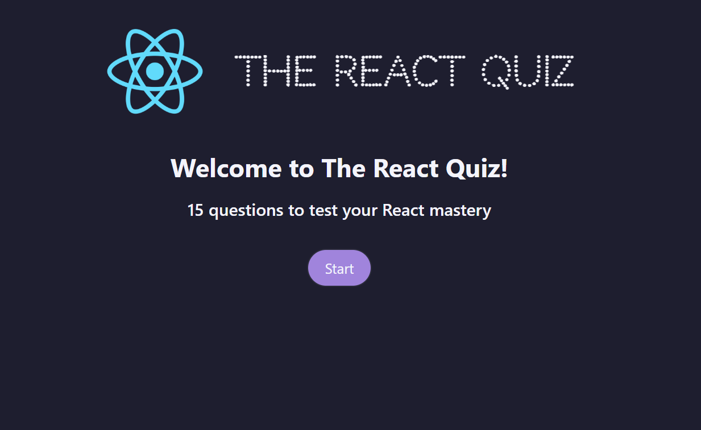
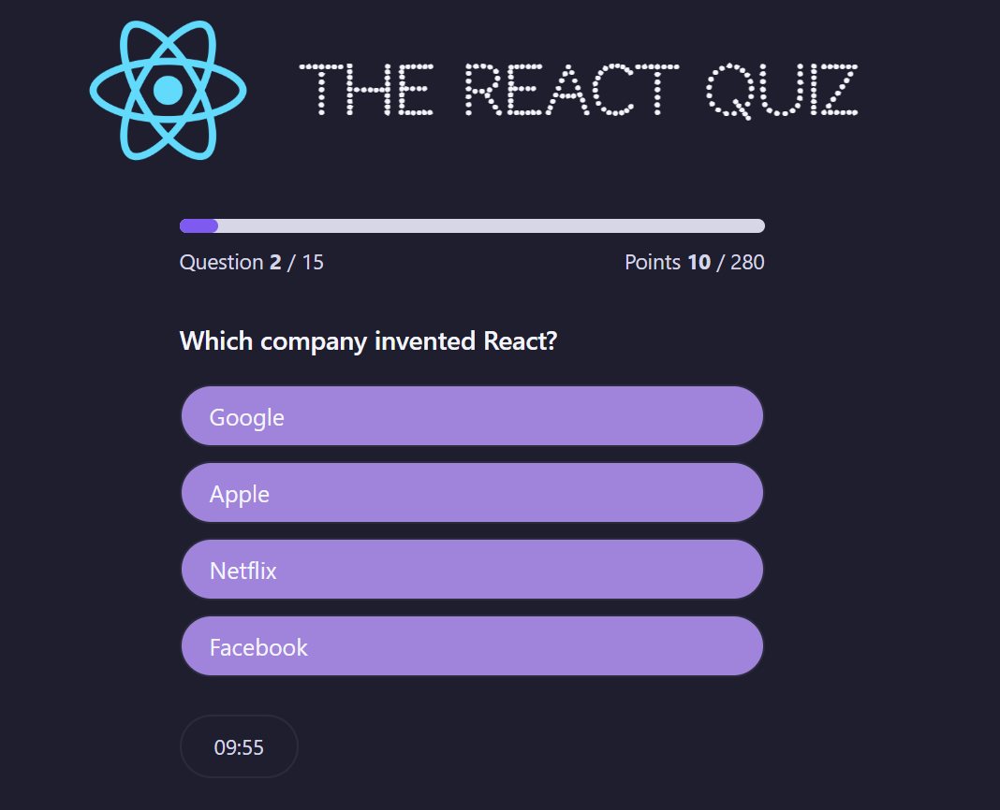
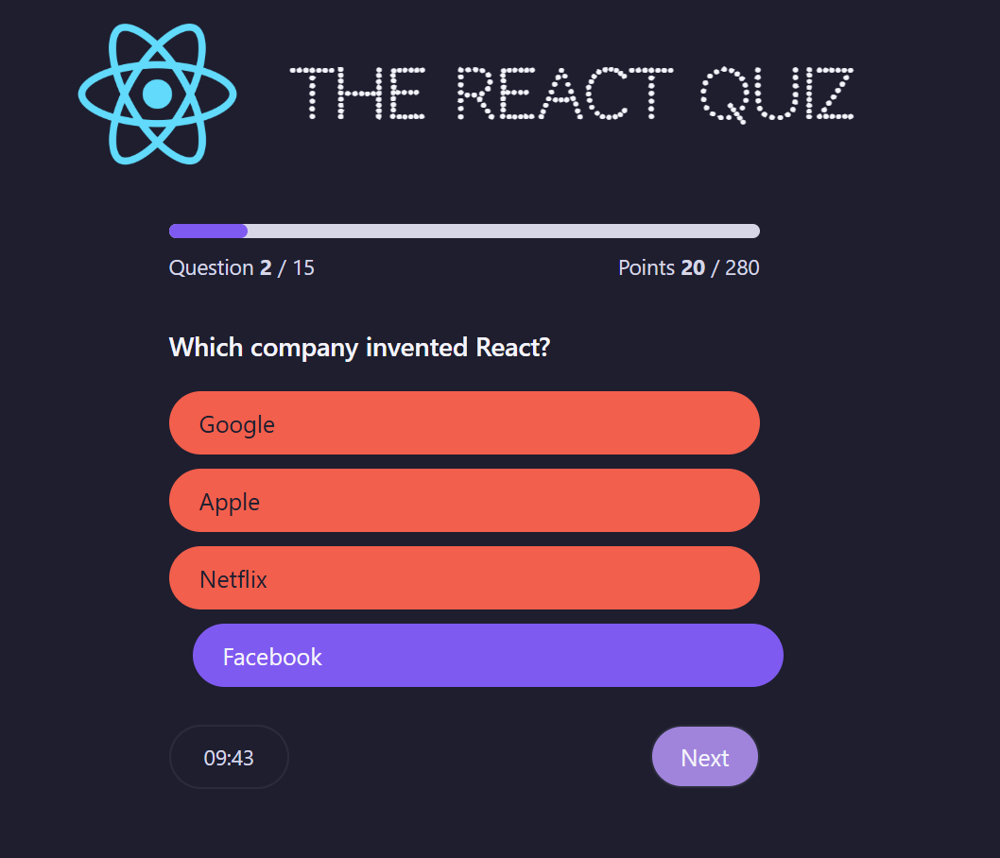
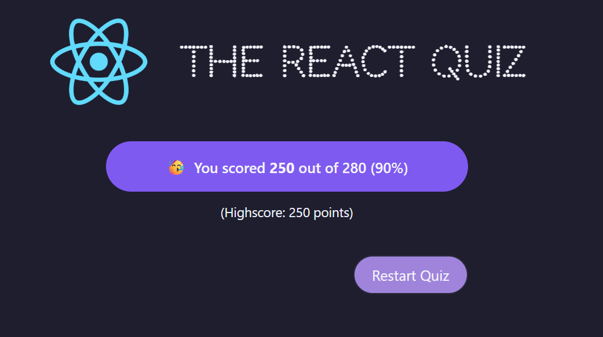

# React Quiz 🎯

A quiz web app built with React for **learning purposes**.

The application features a multiple-choice quiz with scoring, a countdown timer, highscore tracking, and question data served via a mock JSON API. It's designed to practice working with React state management, reducers, side effects, and conditional rendering.

---

## 🛠 Technologies Used

- **React** with `useReducer` and `useEffect`
- **JSON Server** for simulating an API
- **CSS Variables** for consistent theming
- **Modular Component Structure**
- **Vanilla JavaScript** (no external state libraries)

---

## ✨ Features

- Start screen with dynamic status
- Multiple-choice questions with instant feedback
- Countdown timer per question
- Progress indicator and scoring logic
- Highscore tracking
- Option to restart the quiz
- Screenshots for documentation
- Clean, responsive UI

---

## 📸 Screenshots

### 🏠 Home screen

---

### 🚀 Start the quiz

---

### ❓ Answering a question

---

### 🏁 Quiz finished

